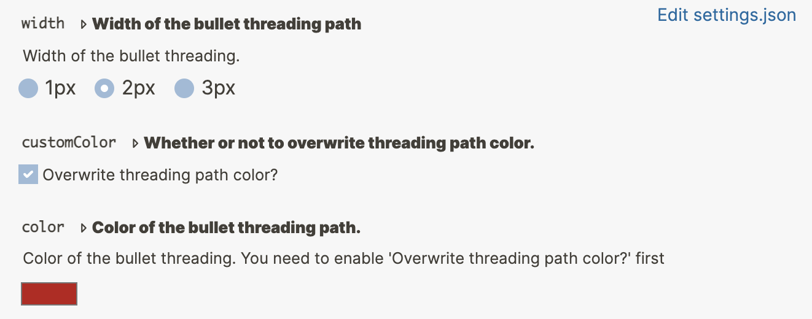

# Logseq Plugin Bullet Threading

Add bullet threading to your active blocks in Logseq.

## Settings

## How it works

This plugin is a simple wrapper of [dev theme](https://github.com/pengx17/logseq-dev-theme).
Internally, it will automatically inject `@import url("https://cdn.jsdelivr.net/gh/pengx17/logseq-dev-theme@master/bullet_threading.css");` into the user's document.

# Issues

Please report any issue to https://github.com/pengx17/logseq-dev-theme instead
